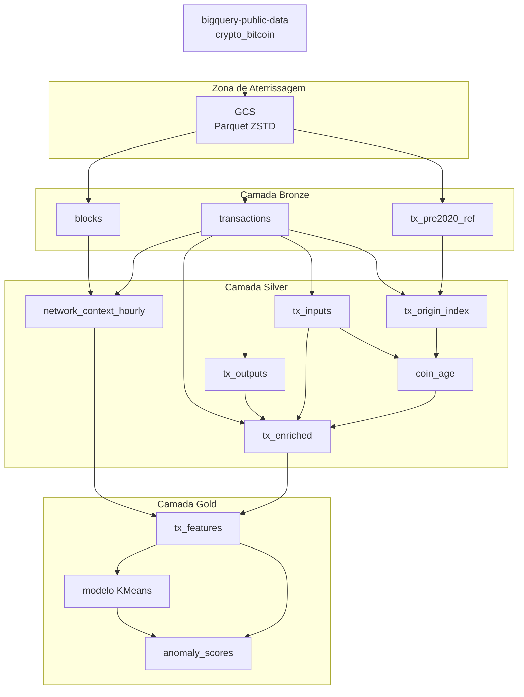

# Detecção de Anomalias em Transações Bitcoin

Pipeline de processamento de dados massivos em lote sobre a Arquitetura Medallion no Google BigQuery, com modelo de clusterização treinado em BigQuery ML para identificar transações Bitcoin com comportamento atípico.


---

## Sumário

- [Sobre o Projeto](#sobre-o-projeto)
- [Stack Tecnológico e Pré-requisitos](#stack-tecnológico-e-pré-requisitos)
- [Estrutura do Projeto](#estrutura-do-projeto)
- [Fluxo de Execução](#fluxo-de-execução)
- [Instruções de Execução](#instruções-de-execução)
- [Notebooks](#notebooks)
- [Documentação por Camada](#documentação-por-camada)
- [Controle de Custos](#controle-de-custos)
- [Status](#status)
- [Autor](#autor)

---

## Sobre o Projeto

### Objetivo

Detectar transações Bitcoin com comportamento estruturalmente atípico usando clusterização não supervisionada, com todo o processamento e a modelagem escritos em SQL puro no BigQuery.

### Domínio

Bitcoin opera no modelo UTXO (Unspent Transaction Output). Não existem contas com saldo: existem pedaços de moeda não gastos, cada um com valor fixo e condição de gasto. Uma transação consome UTXOs existentes (que viram seus *inputs*), cria UTXOs novos (seus *outputs*), e a diferença entre as duas somas é a taxa recolhida pelo minerador.

Esse modelo produz padrões estruturais reconhecíveis. Um pagamento comum gera dois outputs desbalanceados, sendo um deles o troco. Uma exchange consolidando fundos gera muitos inputs e poucos outputs. Um CoinJoin gera dezenas de outputs de valor idêntico para quebrar a heurística de propriedade comum. É essa geometria que o modelo aprende.

### Recorte de dados

- **Fonte:** `bigquery-public-data.crypto_bitcoin`
- **Período:** 01/01/2020 a 31/12/2020
- **Volume:** 112.553.498 transações em 53.222 blocos
- **Motivo da escolha:** 2020 contém três eventos documentados (crash da COVID em março, halving em maio, movimentação de moedas dormentes) que servem de validação externa, e é anterior à distorção causada pelos Ordinals em 2023.

### Funcionalidades

- Ingestão da fonte pública para zona de aterrissagem no Cloud Storage em Parquet comprimido
- Carga para camada Bronze com reconstrução das estruturas aninhadas
- Desaninhamento de arrays de inputs e outputs para tabelas relacionais
- Resolução do grafo de gastos e cálculo da idade dos UTXOs consumidos
- Agregação de contexto de rede por hora para normalização de features
- Matriz de 21 features por transação
- Modelo K-Means com seleção de K por métrica
- Detecção de anomalias com score contínuo preservado
- Rastreabilidade por linha, com identificador de lote e timestamp de processamento

---

## Stack Tecnológico e Pré-requisitos

| Tecnologia | Propósito |
|---|---|
| Google BigQuery | Armazenamento colunar e processamento distribuído |
| BigQuery ML | Treino e inferência do modelo, em SQL |
| Google Cloud Storage | Zona de aterrissagem dos arquivos brutos |
| GoogleSQL | Linguagem de todas as transformações |
| Parquet + ZSTD | Formato e compressão dos arquivos na aterrissagem |

**Pré-requisitos:**

- Projeto GCP com faturamento ativo
- Datasets em multirregião `US` (obrigatório: o dataset público reside lá e o BigQuery não faz consulta entre regiões)
- Bucket do Cloud Storage também em multirregião `US`
- Papéis `roles/bigquery.user` (criar datasets e rodar jobs) e `roles/storage.admin` (criar o bucket)
- Python 3.10+ com `google-cloud-bigquery`, `pandas` e `matplotlib`, para os notebooks

---

## Estrutura do Projeto

```
bitcoin-transactions-anomaly-detection/
├── README.md
├── config.env.example              Gabarito; copie para config.env
├── setup/
│   ├── 00-create-bucket.sh
│   └── 01-create-datasets.sql
├── bronze/
│   ├── README.md
│   ├── 02-export-blocks-to-gcs.sql
│   ├── 03-export-transactions-to-gcs.sql
│   ├── 04-export-references-pre-2020-to-gcs.sql
│   ├── 05-load-gcs-staging.sql
│   ├── 06-create-blocks-table.sql
│   ├── 07-create-transactions-table.sql
│   ├── 08-create-references-pre-2020-table.sql
│   ├── 09-validate-blocks.sql
│   ├── 10-validate-transactions.sql
│   └── 11-clean-staging-tables.sql
├── silver/
│   ├── README.md
│   ├── 12-create-outputs-table.sql
│   ├── 13-create-inputs-table.sql
│   ├── 14-create-transactions-index.sql
│   ├── 15-create-coin-age-table.sql
│   ├── 16-create-network-context-per-hour-table.sql
│   ├── 17-create-enriched-table.sql
│   ├── 18-validate-inputs-outputs.sql
│   └── 19-validate-enriched-table.sql
├── gold/
│   ├── README.md
│   ├── 20-create-features-matrix.sql
│   ├── 21-validate-features-matrix.sql
│   ├── 22-analyze-features-variance.sql
│   ├── 28-create-anomaly-scores.sql
│   ├── 29-validate-anomaly-scores.sql
│   ├── 30-analyze-distance-cutoffs.sql
│   └── 32-analyze-top-anomalies.sql
├── model/
│   ├── 23-create-kmeans-k-sweep.sql
│   ├── 24-create-kmeans-k8-sample-sweep.sql
│   ├── 25-evaluate-kmeans-models.sql
│   ├── 26-evaluate-training-info.sql
│   ├── 27-analyze-model-centroids.sql
│   ├── 31-alignment-with-structural-heuristics.sql
│   ├── 33-create-anomaly-priority-view.sql
│   └── 34-analyze-priority-view.sql
├── docs/
│   └── FEATURES.md
└── notebooks/
    ├── 00-run-pipeline.ipynb
    ├── 01-apresentacao.ipynb
    └── pipeline_lib.py
```

---

## Fluxo de Execução



---

## Instruções de Execução

### Preparação

1. Crie o projeto GCP e vincule uma conta de faturamento ativa.
2. Copie o gabarito de configuração e preencha com os seus valores:

   ```bash
   cp config.env.example config.env
   ```

   `config.env` não vai para o controle de versão. Ele é a fonte única dos
   identificadores de ambiente: os arquivos `.sql` trazem `${BUCKET}` e
   `${LOCATION}` como marcadores, resolvidos em tempo de execução. Nenhum nome de
   projeto ou de bucket está embutido em query nenhuma.

3. Provisione o bucket e habilite as APIs:

   ```bash
   bash setup/00-create-bucket.sh
   ```
4. **Antes de qualquer consulta**, configure o limite de bytes faturados no editor do BigQuery, em Mais > Configurações de consulta > Máximo de bytes faturados. Sugestão: 50 GB para o uso diário.
5. Crie um orçamento com alertas em Faturamento > Orçamentos e alertas.

### Execução

Os scripts são numerados na ordem de execução e devem ser rodados em sequência. Cada um é idempotente e pode ser reexecutado.

Três etapas exigem elevar temporariamente o limite de bytes faturados:

| Etapa | Limite necessário | Motivo |
|---|---|---|
| 03 | 250 GB | Exportação de `transactions` (219,7 GB de leitura) |
| 04 | 60 GB | Exportação da referência pré-2020 (~40 GB) |
| 28 | 100 GB | Inferência sobre 112,5 milhões de linhas |

Retorne ao limite padrão após cada uma.

### Validação

As etapas 09, 10, 18, 19, 21, 22 e 29 são consultas de validação. Os valores esperados estão documentados nos READMEs de cada camada. Divergência indica falha na etapa anterior e o pipeline não deve prosseguir.

---

## Notebooks

Dois notebooks com responsabilidades que não se sobrepõem, e que rodam em lugares
diferentes de propósito.

### [`notebooks/00-run-pipeline.ipynb`](notebooks/00-run-pipeline.ipynb) — execução

Roda **localmente**, ao lado do repositório. Executa as 34 etapas na ordem, um job
por arquivo, e grava `manifesto.json` com `job_id`, duração e bytes faturados de
cada uma. Não contém SQL: lê os arquivos `.sql`, resolve os marcadores de ambiente
com os valores de `config.env` e submete. Leva dezenas de minutos e custa dinheiro.

### [`notebooks/01-apresentacao.ipynb`](notebooks/01-apresentacao.ipynb) — apresentação

**Autocontido**, para colar direto nos notebooks compartilhados do BigQuery Studio.
Não importa nada do repositório e não lê `config.env`: o SQL das seis consultas de
resultado vai embutido, e o projeto vem do contexto da sessão. As consultas são
identificadas pelo **número** — `25`, `27`, `30`, `31`, `32`, `34` — que é o que
casa com as consultas salvas do projeto, já que os nomes após o número divergem.

Ele executa **apenas leitura**: `ML.EVALUATE` e `ML.CENTROIDS`, que leem metadados
do modelo, e quatro agregações sobre tabelas particionadas. Nenhuma célula escreve,
nenhuma reprocessa o pipeline. Todo job carrega um teto de bytes faturados, de modo
que uma consulta cara falha de graça em vez de gerar fatura.

A duplicação do SQL é o preço da autonomia: um notebook que roda sozinho no
BigQuery Studio não tem o repositório ao lado para ler. Ao alterar uma consulta em
`model/`, atualize o `SQL_NN` correspondente no notebook.

## Documentação por Camada

- [`bronze/README.md`](bronze/README.md) — ingestão, zona de aterrissagem e reconstrução de arrays
- [`silver/README.md`](silver/README.md) — desaninhamento, grafo de gastos e contexto de rede
- [`gold/README.md`](gold/README.md) — matriz de features, modelagem e inferência
- [`docs/FEATURES.md`](docs/FEATURES.md) — as 21 features, cálculo, estatísticas e justificativa

---

## Controle de Custos

O BigQuery cobra por bytes lidos, não por linhas retornadas. Um erro de filtro pode custar mais que o projeto inteiro.

Práticas adotadas:

**Particionamento por dia** em todas as tabelas com dimensão temporal, permitindo poda de partições.

**`require_partition_filter = TRUE`** em todas essas tabelas, o que faz o BigQuery rejeitar consultas sem filtro de data em vez de varrer tudo.

**Clustering pela coluna de join** de cada tabela, e não pela chave primária por padrão. Em `silver.tx_inputs`, por exemplo, o clustering é por `spent_transaction_hash`, porque é essa a coluna que participa do join mais caro do pipeline.

**Materialização em vez de views encadeadas.** Views empilhadas rescaneiam a origem a cada consulta. Materializar troca custo de processamento recorrente por custo de armazenamento fixo.

**Nunca usar `SELECT *`** contra tabelas grandes, exceto quando a intenção declarada é cópia integral.

### Ganhos medidos

| Otimização | Antes | Depois | Redução |
|---|---:|---:|---:|
| Recorte e particionamento da ingestão | 2,37 TB | 219,7 GB | ~11x |
| Materialização do índice de origem | ~15 TB | < 100 GB | ~150x |

---

## Status

Pipeline completo, executado ponta a ponta e validado em todas as camadas.

### Resultado principal

Modelo K-Means com K=8, treinado em amostra determinística de 10%, aplicado sobre as 112.500.276 transações não coinbase de 2020.

| Heurística estrutural independente | Concordância com o modelo | Fator sobre o baseline |
|---|---:|---:|
| Alta contagem de outputs (>= 100) | 89,6% | 90x |
| Alta contagem de inputs (>= 100) | 39,8% | 40x |
| Moeda dormente (> 5 anos) | 10,4% | 10x |
| Alta repetição de valores | 3,8% | 4x |
| Baseline: todas as transações | 1,0% | 1x |

O modelo nunca recebeu nenhuma dessas regras. As duas linhas metodologicamente mais limpas são moeda dormente e repetição de valores, porque as outras duas compartilham grandezas com features do modelo.

Os READMEs de cada camada trazem as decisões, as validações e as limitações conhecidas.
